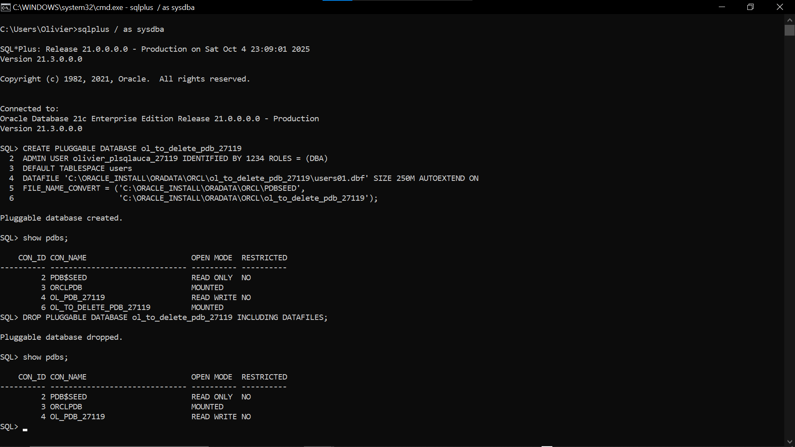
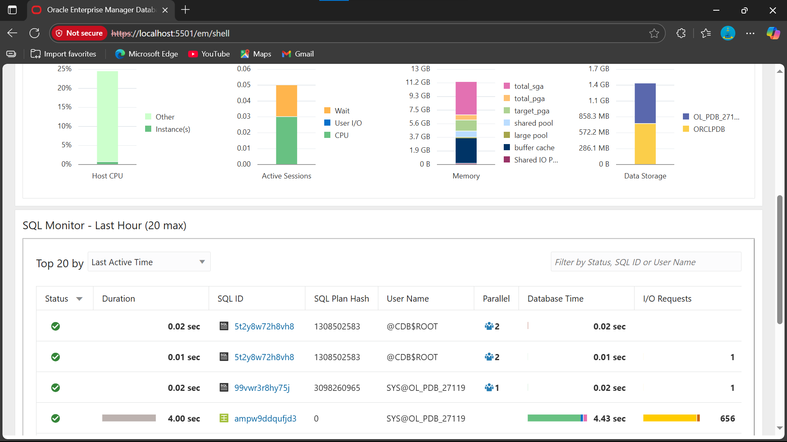

# PL/SQL Pdb creation Assignment

**Student:** Byiringiro Olivier  27119

**Course:** Database Development with PL/SQL (INSY 8311)  

**Instructor:** Eric Maniraguha 

**Date:** 2025-10-05  

=====================================================================

## 1️⃣ Overview of Tasks

This project involved creating and managing a Pluggable Database (PDB) in Oracle 21c and connecting it to Oracle Enterprise Manager (OEM Express).

### Main objectives:

> Create a new PDB named **ol_pdb_27119**

> Create and unlock a new user **olivier_plsqlauca_27119**

> Connect to the PDB using SQL*Plus and verify access

> Configure and access Oracle Enterprise Manager (OEM)

> Below are the screenshots for:

PDB creation & deletion **(Task 2)**

OEM dashboard view **(Task 3)**

## 2️⃣ Issues I encountered:

> On task 2, i could not delete the pdb.

> I later figured out that it was open (in read-write mode).

> I closed it (mounted) **ALTER PLUGGABLE DATABASE OL_TO_DELETE_PDB_27119 CLOSE IMMEDIATE;** then dropped it.

> Both HTTP/HTTPS port were not set.

> solved it by setting the port (for HTTPS) 5001.

> **EXEC DBMS_XDB_CONFIG.SETHTTPSPORT(5501);**

============================================================================

#   END OF TASKS

============================================================================